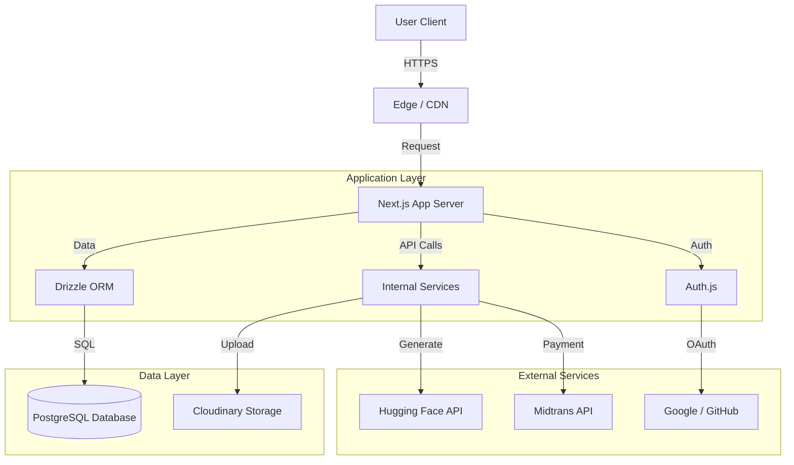

# Architecture Documentation

## System Overview

BrandAI is a SaaS application built on the **Next.js** framework, designed to provide AI-powered branding tools. It leverages a modern stack with server-side rendering, edge compatibility where possible, and a robust database layer.

## Technology Stack

| Component              | Technology                                    | Description                                             |
| ---------------------- | --------------------------------------------- | ------------------------------------------------------- |
| **Frontend Framework** | [Next.js 16](https://nextjs.org/)             | App Router, Server Components, Server Actions.          |
| **Language**           | [TypeScript](https://www.typescriptlang.org/) | Static typing for reliability and developer experience. |
| **Styling**            | [Tailwind CSS](https://tailwindcss.com/)      | Utility-first CSS framework with HeroUI components.     |
| **Database**           | [PostgreSQL](https://www.postgresql.org/)     | Relational database for structured data.                |
| **ORM**                | [Drizzle ORM](https://orm.drizzle.team/)      | Type-safe database access and migrations.               |
| **Authentication**     | [Auth.js (NextAuth) v5](https://authjs.dev/)  | Secure authentication for web and edge.                 |
| **Payment Gateway**    | [Midtrans](https://midtrans.com/)             | Payment processing for Indonesian market.               |
| **AI Inference**       | [Hugging Face](https://huggingface.co/)       | Access to image generation models.                      |
| **Image Processing**   | Sharp, Potrace, @neplex/vectorizer            | Image manipulation and vectorization.                   |
| **Canvas Editor**      | [Konva.js](https://konvajs.org/)              | (Planned) Client-side canvas for logo editing.          |

## High-Level Architecture

## Database Schema (Key Entities)

The database is managed using Drizzle ORM. Key tables include:

-  **Users**: Stores user identity, credits, and subscription status.
-  **Brands**: Stores brand identity data (colors, fonts, etc.).
-  **Logos**: References generated logos, prompts, and storage URLs.
   -  _Relation_: One-to-Many with Users and Brands.
-  **Transactions**: Records payment history and order statuses.
-  **Subscriptions**: Tracks active subscription periods for users.

## Key Services

### 1. Logo Generation Service

Located in `src/services/generate`, this service handles the interaction with AI models.

-  Constructs prompts based on user input and brand settings.
-  Calls external inference APIs.
-  Processes the raw image response.

### 2. Vectorization Service

Handles the conversion of raster images to SVG.

-  input: `Buffer` (PNG/JPG)
-  output: `String` (SVG)
-  Uses `@neplex/vectorizer` for tracing bitmaps into vectors.

### 3. Payment Service

Manages the lifecycle of a transaction.

-  Creates transaction records in Postgres.
-  Generates Snap tokens via Midtrans.
-  Handles Webhook notifications to update transaction status (Pending -> Success/Failure).

## Directory Structure

-  `src/app`: Next.js App Router pages and API endpoints.
-  `src/components`: Reusable UI components.
-  `src/db`: Drizzle schema definitions and connection logic.
-  `src/services`: Business logic separated from the UI layer.
-  `src/lib`: Utility functions and shared helpers.
