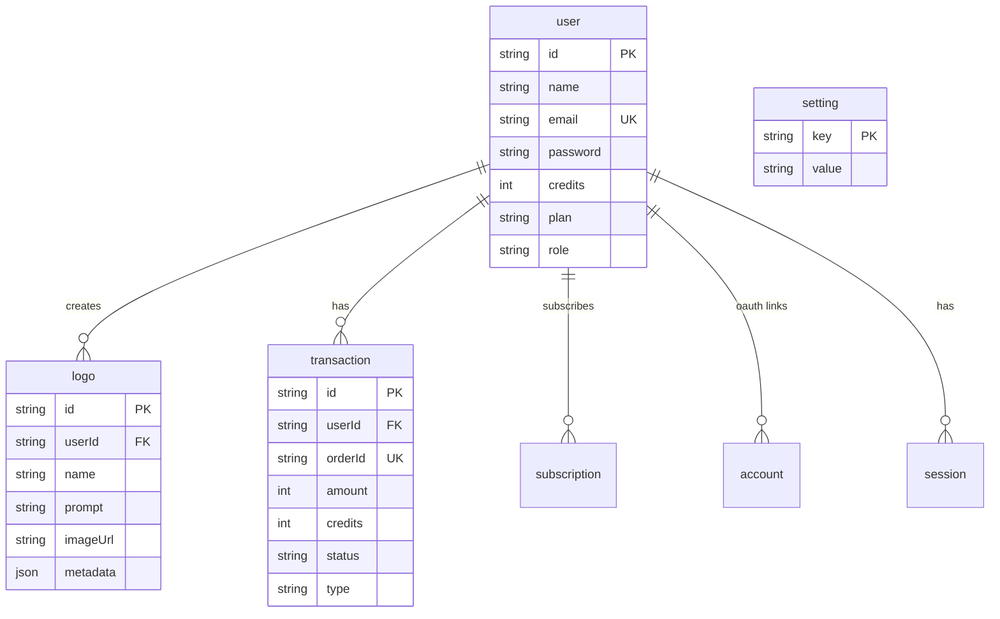
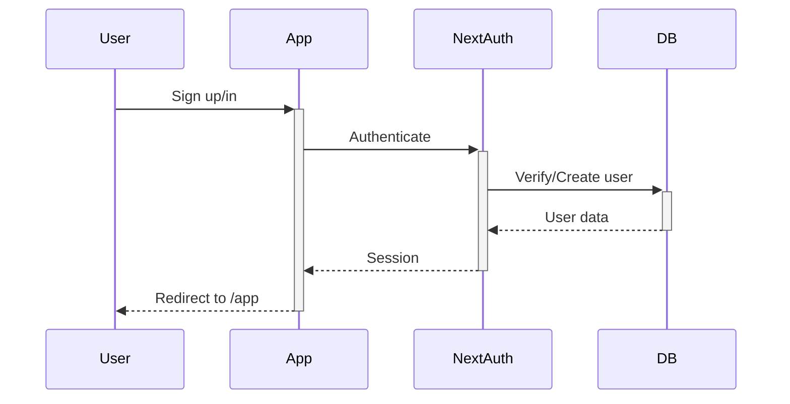
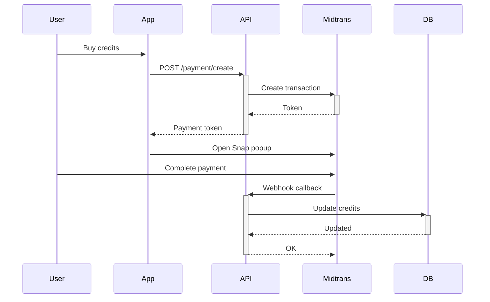

# BerandAI - Architecture Documentation

## Overview

AI-powered logo generator with credit-based payment system.

---

## Tech Stack

| Layer     | Technology                  |
| --------- | --------------------------- |
| Framework | Next.js 15 (App Router)     |
| UI        | HeroUI + Tailwind CSS       |
| Database  | PostgreSQL (Supabase)       |
| ORM       | Drizzle ORM                 |
| Auth      | NextAuth.js v5              |
| Payment   | Midtrans                    |
| Storage   | Supabase Storage            |
| AI        | Hugging Face / Pollinations |

---

## Database Schema



---

## API Routes

### Auth

| Route                     | Method | Description       |
| ------------------------- | ------ | ----------------- |
| `/api/auth/[...nextauth]` | ALL    | NextAuth handlers |
| `/api/auth/register`      | POST   | User registration |

### User

| Route                    | Method | Description         |
| ------------------------ | ------ | ------------------- |
| `/api/user/credits`      | GET    | Get user credits    |
| `/api/user/profile`      | PUT    | Update profile      |
| `/api/user/password`     | PUT    | Change password     |
| `/api/user/transactions` | GET    | Transaction history |

### Logo

| Route                | Method | Description                 |
| -------------------- | ------ | --------------------------- |
| `/api/generate/logo` | POST   | Generate logo (uses credit) |
| `/api/logos`         | GET    | Get user's logos            |

### Payment

| Route                  | Method | Description          |
| ---------------------- | ------ | -------------------- |
| `/api/payment/create`  | POST   | Create payment       |
| `/api/payment/webhook` | POST   | Midtrans callback    |
| `/api/pricing`         | GET    | Get pricing settings |

### Admin

| Route                             | Method  | Description      |
| --------------------------------- | ------- | ---------------- |
| `/api/admin/users`                | GET     | List all users   |
| `/api/admin/users/topup`          | POST    | Manual topup     |
| `/api/admin/users/role`           | PUT     | Change user role |
| `/api/admin/transactions`         | GET     | All transactions |
| `/api/admin/transactions/approve` | POST    | Approve pending  |
| `/api/admin/settings`             | GET/PUT | Pricing settings |

---

## File Structure

```
src/
├── app/
│   ├── (pages)
│   │   ├── page.tsx          # Landing
│   │   ├── about/            # About page
│   │   └── create/logo/      # Logo wizard
│   ├── app/                   # User dashboard
│   │   ├── page.tsx          # Dashboard
│   │   ├── credits/          # Buy credits
│   │   └── profile/          # User profile
│   ├── admin/                 # Admin panel
│   │   ├── page.tsx          # Admin dashboard
│   │   ├── users/
│   │   ├── transactions/
│   │   └── pricing/
│   ├── auth/                  # Auth pages
│   │   ├── sign-in/
│   │   └── sign-up/
│   └── api/                   # API routes
├── components/
│   ├── Header.tsx
│   ├── Footer.tsx
│   ├── Hero.tsx
│   ├── Pricing.tsx
│   ├── UserMenu.tsx
│   └── AdminSidebar.tsx
├── db/
│   ├── index.ts              # DB connection
│   ├── schema.ts             # Drizzle schema
│   └── seed.ts               # Initial data
├── lib/
│   ├── auth.ts               # NextAuth config
│   ├── midtrans.ts           # Payment helper
│   └── storage.ts            # File upload
└── config/
    └── site.ts               # Site config
```

---

## Authentication Flow



---

## Payment Flow


